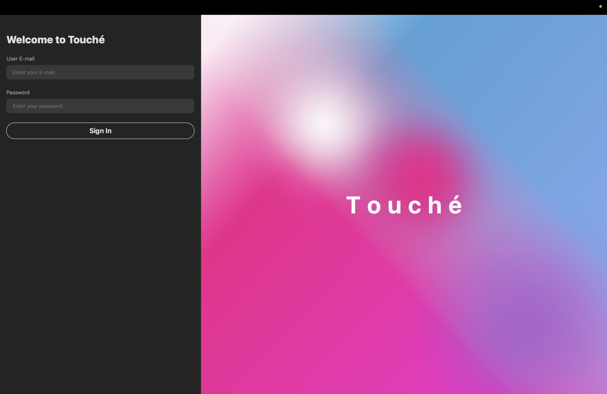
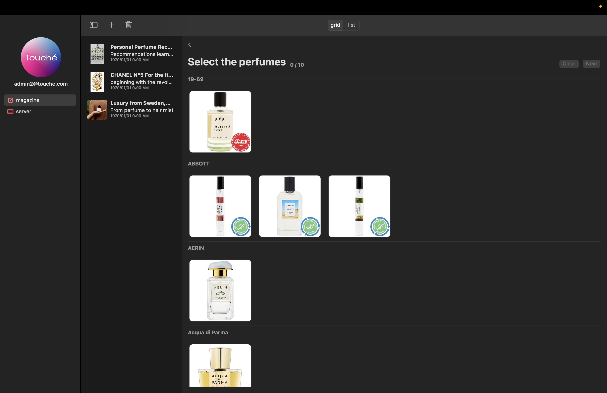
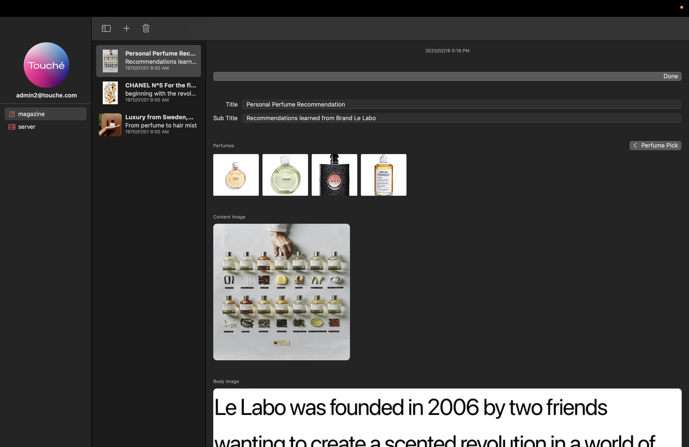
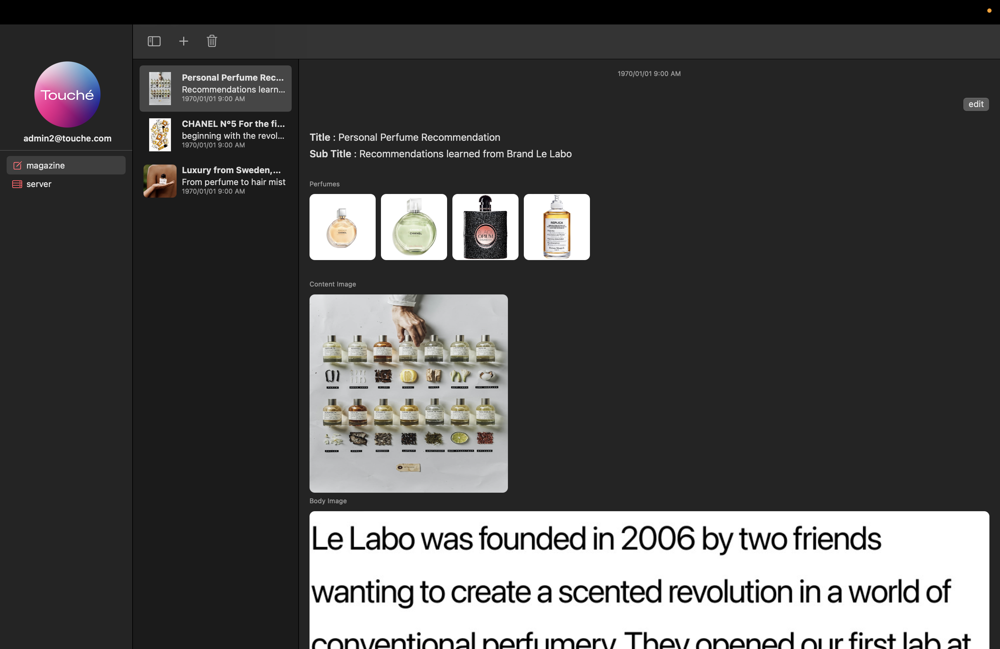
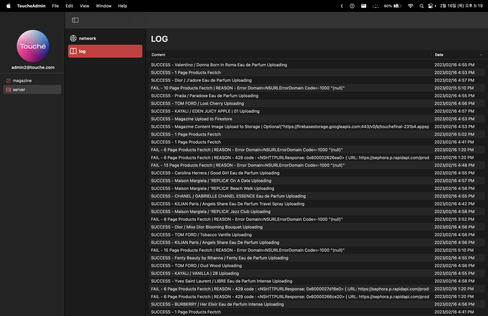
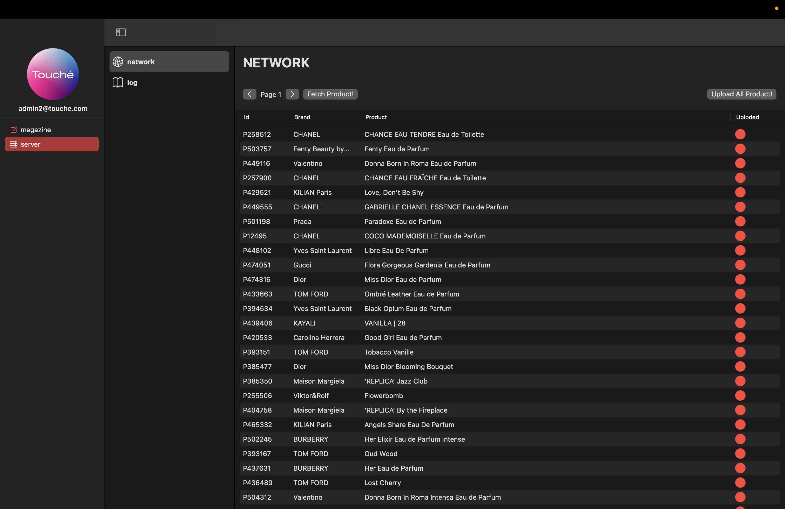

# 뚜셰(Touché) 관리자

<p align=center>
    
</p>


## 프로젝트 소개 


> `향수`에 대해 관심을 갖기 시작해, 다양한 `향수` 정보르 얻고 싶은 사람을 위한
> 기본적인 `향수` 정보, 시각화 정보를 제공해 `향수` 정보를 보다 직관적으로 알 수 있도록 돕는 `뚜셰(Touché) 관리자`앱니다.


## 컨벤션


```
- [Feat] : 새로운 기능 추가
- [Add]: 새로운 파일 추가 (json, img, asset, 목업데이터 등등)
- [Fix] : 버그 수정
- [Docs] : 문서 수정
- [Style] : 코드 포맷팅, 세미콜론 누락, 코드 변경이 없는 경우
- [Refactor] : 코드 리펙토링
- [Test] : 테스트 코드, 리펙토링 테스트 코드 추가
- [Chore] : 빌드 업무 수정, 패키지 매니저 수정
```


## 주요기능과 스크린샷


<table border>
    <tr>
        <td></td>
    </tr>
    <tr>
        <td><p align=center>로그인 뷰</p></td>
    </tr>
    <tr>
        <td></td>
        <td></td>
        <td></td>
    </tr>
    <tr>
        <td><p align=center>메거진 등록 - 향수 선택 뷰</p></td>
        <td><p align=center>메거진 등록 - 메거진 수정/저장 뷰</p></td>
        <td><p align=center>메거진 뷰</p></td>
    </tr>
    <tr>
        <td></td>
        <td></td>
    </tr>
    <tr>
        <td><p align=center>데이터 로그 확인 뷰</p></td>
        <td><p align=center>데이터 업로드 뷰</p></td>
    </tr>
</table>


## 프로젝트 정보

1. 최초 로그인을 실행한다.
2. 메거진탭을 선택해서 원하는 작업을 실행한다.
    - `+ 버튼`을 눌러 메거진 데이터를 생성한다.
    - `trash 버튼`을 눌러 메거진 데이터를 삭제한다.
    - `edit 버튼`을 눌러 메거진 데이터를 수정한다.
3. 서버탭을 선택해서 네트워크를 선택해 향수데이터를 서버에 저장한다.
    - `제품 불러오기`를 눌러 60개 향수 제품을 불러온다.
    - 향수 제품을 클릭해서 하나씩 서버에 저장한다.
    - 모두 저장하기 버튼을 눌러 전부 저장한다.
4. 서버탭을 선택해서 로그를 선택해 향수데이터 및 메거진데이터의 서버와 디바이스 통신 로그를  확인할 수 있다.


## 데모영상


## 개발자


|  |
| :------------------------------------------------------------------------: |
|                   광현</br>[@seo-kh](https://github.com/seo-kh)<br/>        |


## 연관 링크

뚜셰소비자앱 레포지터리 : [https://github.com/APPSCHOOL1-REPO/finalproject-touche](https://github.com/APPSCHOOL1-REPO/finalproject-touche)